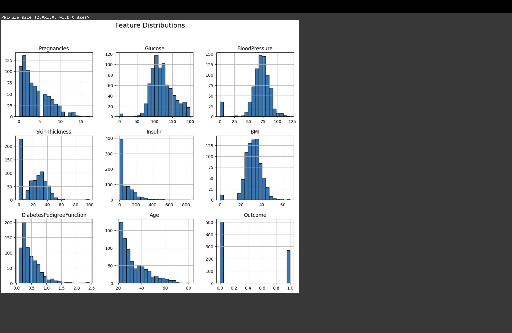

# Machine Learning for Diabetes Diagnosis

## Project Overview
This project implements **Machine Learning** techniques to predict whether a patient has diabetes based on diagnostic measurements. The dataset is originally from the **National Institute of Diabetes and Digestive and Kidney Diseases**. Three classification algorithms are used:

- **Support Vector Machine (SVM)**
- **K-Nearest Neighbors (KNN)**
- **Decision Tree**

The project also includes **data visualization** techniques to analyze and interpret the dataset effectively.

## Features Implemented
Exploratory Data Analysis (EDA)  
Model Training & Evaluation  
Data Visualization (Matplotlib & Seaborn)  
Model Comparison (Accuracy & Confusion Matrix)  
Feature Importance Analysis  

---

## Installation & Setup

### 1. Clone the Repository
```sh
git clone <your-repo-url>
cd <your-repo-folder>
```

### 2. Install Dependencies
Ensure you have Python installed and run the following command:
```sh
pip install pandas numpy matplotlib seaborn scikit-learn
```

### 3. Run the Project
Execute the Python script to train models and generate visualizations:
```sh
python machine_learning_for_diabetes_diagnosis_.py
```

---

## Dataset
The dataset consists of multiple diagnostic features used to predict diabetes. The features include:
- **Pregnancies**
- **Glucose Level**
- **Blood Pressure**
- **Skin Thickness**
- **Insulin Level**
- **BMI**
- **Diabetes Pedigree Function**
- **Age**

The **target variable** indicates whether the patient has diabetes (**1**) or not (**0**).

---

## Visualizations Included
🔹 **Feature Distributions** (Histograms)  
🔹 **Correlation Heatmap**  
🔹 **Model Performance (Confusion Matrix, Accuracy Comparison)**  
🔹 **Feature Importance (Decision Tree Algorithm)**  

---

## Model Performance
| Model | Accuracy |
|--------|----------|
| SVM | 80.5% |
| KNN | 72.0% |
| Decision Tree | 76.6% |

---
## A Quick Glance at all the Visualization Techniques Used

From the above EDA we can see that dataset is negatively skewed, with more non-diabetic cases than diabetic ones. Most patients are aged 20-40, with common BMI values between 25-35. Features like glucose, insulin, and age show extreme values, and missing data in insulin & skin thickness may require imputation. 


From the above heatmap we can say that:
As,Glucose and Outcome (Diabetes) are highly correlated,glucose is a strong predictor.
Features with low correlation (<0.3) with Outcome may contribute less to prediction.
The two independent variables ( BMI & Skin Thickness) have high correlation, one might be redundant.


The bar graph that was used to visualize the accuracy of each three classification models i.e SVM, KNN, Decision Tree and lets us decide which among them gives the highest accuracy in this case its SVM.


The confusion matrix is used to check how many of the values are true positive(TP)= 29  ,true negative(TN)= 98 (i.e correctly predicted positive,negative) and false positive = 9 and false negative = 18 (wrongly predicted positive,negative) by using the SVM Model

---

## Author
👩‍💻 **K. Harshitha Reddy**  
📧 harshithareddyk2002@gmail.com  
  


