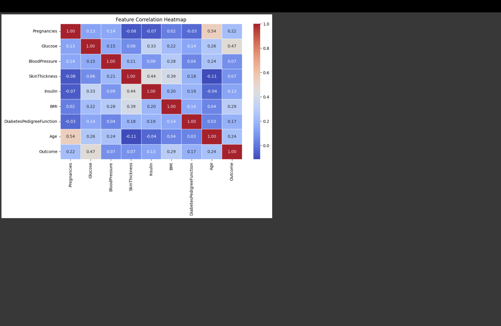

# Machine Learning for Diabetes Diagnosis

## Project Overview
This project implements **Machine Learning** techniques to predict whether a patient has diabetes based on diagnostic measurements. The dataset is originally from the **National Institute of Diabetes and Digestive and Kidney Diseases**. Three classification algorithms are used:

- **Support Vector Machine (SVM)**
- **K-Nearest Neighbors (KNN)**
- **Decision Tree**

The project also includes **data visualization** techniques to analyze and interpret the dataset effectively.

## Features Implemented
Exploratory Data Analysis (EDA)  
Model Training & Evaluation  
Data Visualization (Matplotlib & Seaborn)  
Model Comparison (Accuracy & Confusion Matrix)  
Feature Importance Analysis  

---

## Installation & Setup

### 1. Clone the Repository
```sh
git clone <your-repo-url>
cd <your-repo-folder>
```

### 2. Install Dependencies
Ensure you have Python installed and run the following command:
```sh
pip install pandas numpy matplotlib seaborn scikit-learn
```

### 3. Run the Project
Execute the Python script to train models and generate visualizations:
```sh
python machine_learning_for_diabetes_diagnosis_.py
```

---

## Dataset
The dataset consists of multiple diagnostic features used to predict diabetes. The features include:
- **Pregnancies**
- **Glucose Level**
- **Blood Pressure**
- **Skin Thickness**
- **Insulin Level**
- **BMI**
- **Diabetes Pedigree Function**
- **Age**

The **target variable** indicates whether the patient has diabetes (**1**) or not (**0**).

---

## Visualizations Included
🔹 **Feature Distributions** (Histograms)  
🔹 **Correlation Heatmap**  
🔹 **Model Performance (Confusion Matrix, Accuracy Comparison)**  
🔹 **Feature Importance (Decision Tree Algorithm)**  

---

## Model Performance
| Model | Accuracy |
|--------|----------|
| SVM | 80.5% |
| KNN | 72.0% |
| Decision Tree | 76.6% |

---
## A Quick Glance at all the Visualization Techniques Used




---

## Author
👩‍💻 **K. Harshitha Reddy**  
📧 harshithareddyk2002@gmail.com  
  


